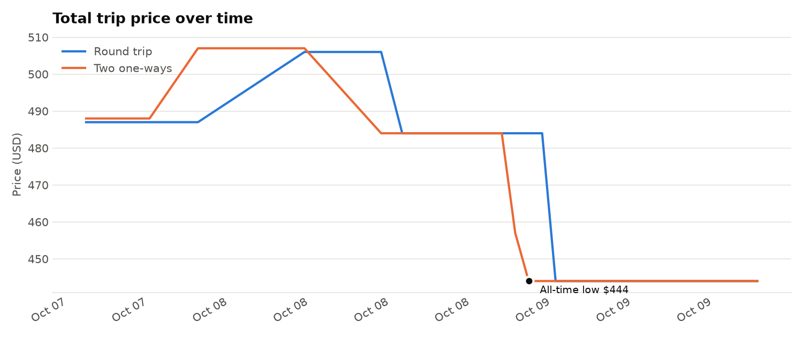
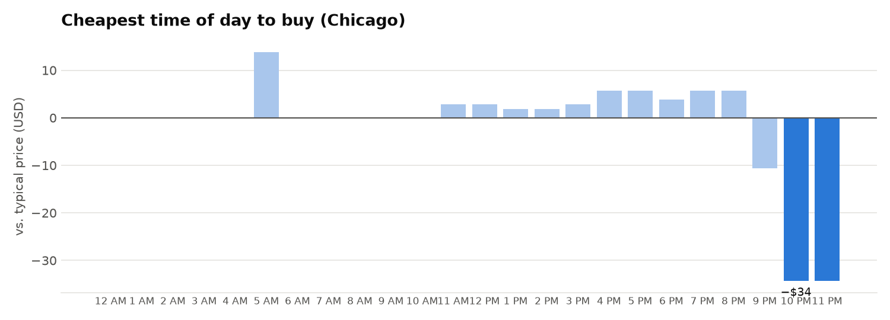
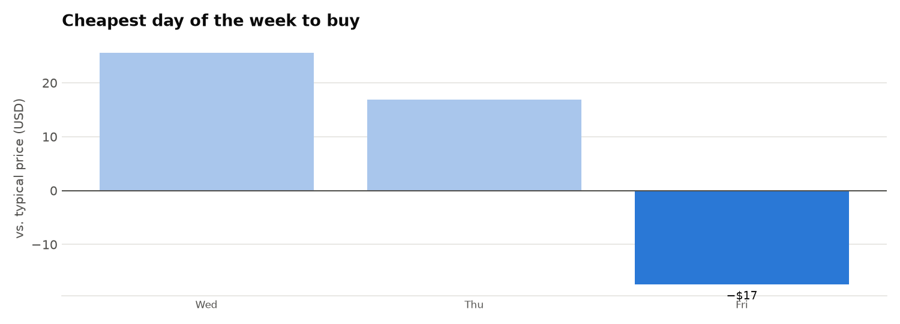

# ✈️ United ORD ⇄ DFW price tracker

**Trip:** Thu Feb 25 2027 ORD→DFW after 4 PM · Sun Feb 28 2027 DFW→ORD after 4 PM · 1 adult, economy (no Basic Economy)
_Updated 2026-10-09 15:17 Chicago time · 37 checks so far · all times Chicago_

## Right now

🟢 **BUY** — This is the lowest price the bot has ever seen.

| | |
|---|---|
| **Cheapest way to book now** | **$444** as a round trip |
| Round trip | $444 |
| Two one-ways (out + back) | $444 |
| All-time low | $444 on Thu Oct 08, 10 PM |
| All-time high | $506 |
| Average | $461 |
| Days until departure | 139 |

**Cheapest flights right now**

| Search | Price | Flight | Cheapest nonstop |
|---|---|---|---|
| Thu ORD→DFW | $197 | 19:49→22:26 nonstop | $197 |
| Sun DFW→ORD | $247 | 19:55→22:26 nonstop | $247 |
| Round trip (outbound shown) | $444 | 19:49→22:26 nonstop | $444 |

## Price history

## Best time of day

> ⏳ Only 2 day(s) of data — patterns below are unreliable until about 7 days.

Cheapest hour so far: **10 PM**, about **$34 below** that day's average.

## Best day of the week

> ⏳ Only 2 day(s) of data — patterns below are unreliable until about 7 days.

Cheapest day so far: **Friday**, about **$17 below** that week's average.

| Day | Avg price | vs. typical | Checks |
|---|---|---|---|
| Wednesday | $487 | +26 | 3 |
| Thursday | $478 | +17 | 15 |
| Friday | $444 | -17 | 19 |

## Daily range (last 14 days)

| Date | Low | High | Avg |
|---|---|---|---|
| Fri Oct 09 | $444 | $444 | $444 |
| Thu Oct 08 | $444 | $506 | $478 |
| Wed Oct 07 | $487 | $487 | $487 |

_Raw data: `data/prices.csv` (one row per search per hour) and `data/options.csv` (every United flight seen)._
