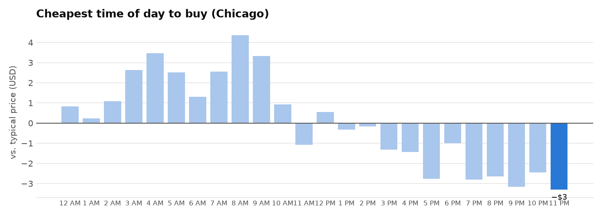
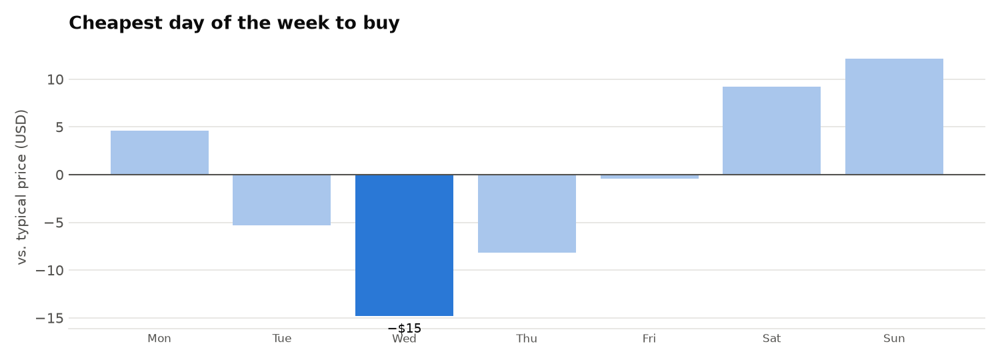

# ✈️ United ORD ⇄ DFW price tracker

**Trip:** Thu Feb 25 2027 ORD→DFW after 4 PM · Sun Feb 28 2027 DFW→ORD after 4 PM · 1 adult, economy (no Basic Economy)
_Updated 2026-11-24 11:17 Chicago time · 1320 checks so far · all times Chicago_

## Right now

⚪ **WAIT** — 25% of past checks were cheaper; the low is $389.

| | |
|---|---|
| **Cheapest way to book now** | **$457** as a round trip |
| Round trip | $457 |
| Two one-ways (out + back) | $458 |
| All-time low | $389 on Wed Oct 21, 05 AM |
| All-time high | $548 |
| Average | $475 |
| Days until departure | 93 |

**Cheapest flights right now**

| Search | Price | Flight | Cheapest nonstop |
|---|---|---|---|
| Thu ORD→DFW | $214 | 20:09→23:02 nonstop | $214 |
| Sun DFW→ORD | $244 | 19:53→22:26 nonstop | $244 |
| Round trip (outbound shown) | $457 | 20:09→23:02 nonstop | $457 |

## Price history

## Best time of day

Cheapest hour so far: **11 PM**, about **$3 below** that day's average.

## Best day of the week

Cheapest day so far: **Wednesday**, about **$15 below** that week's average.

| Day | Avg price | vs. typical | Checks |
|---|---|---|---|
| Monday | $483 | +4 | 178 |
| Tuesday | $474 | -5 | 178 |
| Wednesday | $462 | -15 | 165 |
| Thursday | $466 | -8 | 176 |
| Friday | $472 | -0 | 191 |
| Saturday | $482 | +9 | 197 |
| Sunday | $484 | +12 | 197 |

## Daily range (last 14 days)

| Date | Low | High | Avg |
|---|---|---|---|
| Tue Nov 24 | $457 | $506 | $494 |
| Mon Nov 23 | $488 | $489 | $488 |
| Sun Nov 22 | $488 | $489 | $488 |
| Sat Nov 21 | $488 | $489 | $488 |
| Fri Nov 20 | $488 | $489 | $488 |
| Thu Nov 19 | $488 | $489 | $488 |
| Wed Nov 18 | $488 | $502 | $492 |
| Tue Nov 17 | $488 | $503 | $490 |
| Mon Nov 16 | $488 | $507 | $497 |
| Sun Nov 15 | $497 | $508 | $498 |
| Sat Nov 14 | $497 | $498 | $497 |
| Fri Nov 13 | $497 | $516 | $499 |
| Thu Nov 12 | $487 | $498 | $490 |
| Wed Nov 11 | $487 | $488 | $487 |

_Raw data: `data/prices.csv` (one row per search per hour) and `data/options.csv` (every United flight seen)._
